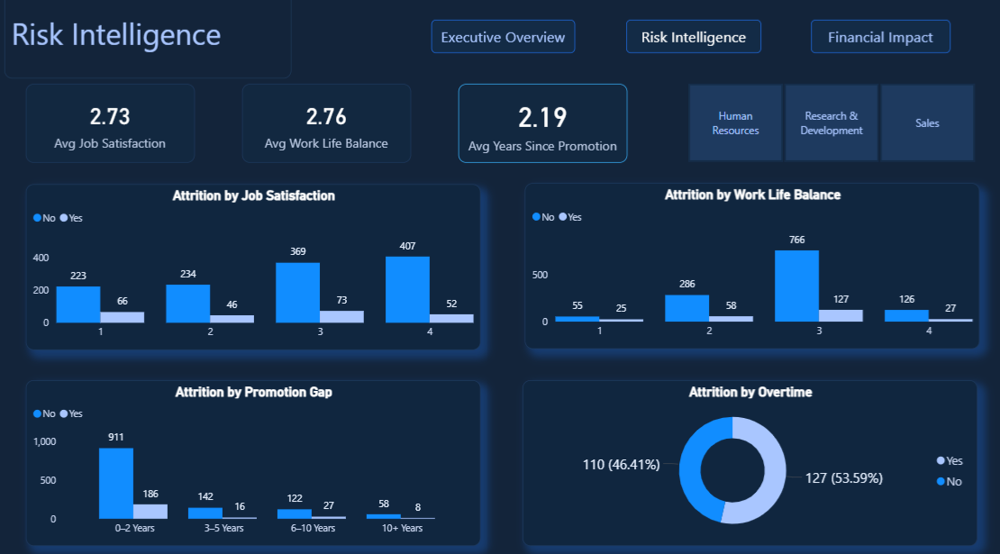
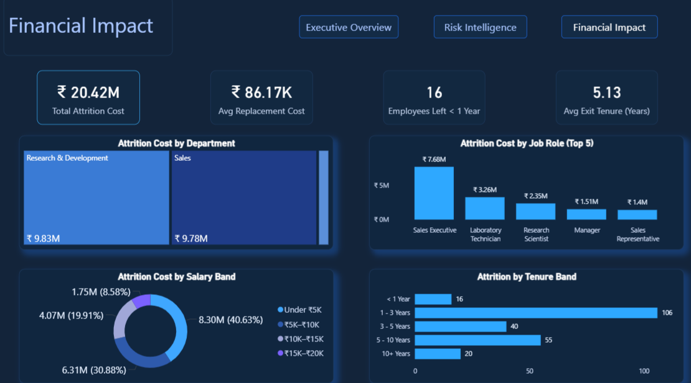

# 👥 HR Workforce Intelligence & Attrition Risk Analysis

## 📌 Project Overview
An end-to-end workforce analytics project analyzing employee attrition patterns, workforce risk indicators, and the financial impact of employee turnover using SQL, Excel, and Power BI.

The dataset is based on the **IBM HR Analytics Employee Attrition dataset** containing employee demographics, job roles, satisfaction metrics, and employment history.

Key characteristics of the dataset:

• 1,470 Employees  
• 237 Attrition Cases  
• 16.12% Attrition Rate  

The objective of this project was to identify the primary drivers of employee attrition, evaluate workforce risk indicators, and quantify the financial impact of employee turnover to support data-driven HR strategy.

---

## 🛠 Tools & Technologies

**SQL (MySQL)** – Data exploration & workforce KPI analysis  
**Excel** – Attrition cost modeling & scenario analysis  
**Power BI** – Interactive dashboard and visualization layer  
**Advanced SQL** – Aggregations, CASE logic, Window Functions  

---

## 📂 Repository Structure

```
hr-workforce-intelligence-attrition-analysis/
│
├── Insights/
│ └── HR_Workforce_Intelligence_Insights.docx
│
├── sql/
│ ├── hr_basic_analysis.sql
│ └── hr_advanced_analysis.sql
│
├── Excel/
│ └── HR_Workforce_Attrition_Cost_Model.xlsx
│
├── screenshots/
│ ├── executive_overview.png
│ ├── risk_intelligence.png
│ └── financial_impact.png
│
├── dashboard/
│ └── HR_Workforce_Intelligence.pbix
│
└── README.md
```


---

## 📊 KPIs Implemented

• Total Employees  
• Attrition Count  
• Attrition Rate  
• Department-Level Attrition Distribution  
• Job Role Attrition Analysis  
• Age Band Attrition Distribution  
• Salary Band Attrition Analysis  
• Promotion Gap Analysis  
• Overtime vs Attrition Impact  
• Average Job Satisfaction  
• Average Work-Life Balance  
• Attrition Cost Estimation  
• Attrition Cost by Department  
• Attrition Cost by Salary Band  
• Attrition Cost by Risk Category  

---

## 📊 Dashboard

### 1️⃣ Executive Overview – Workforce Attrition Summary


This page provides a high-level summary of workforce attrition including overall attrition rate, department-level attrition distribution, and employee demographic analysis.

---

### 2️⃣ Risk Intelligence – Attrition Risk Drivers


This page analyzes key employee risk indicators including job satisfaction, work-life balance, promotion gaps, and overtime impact on employee turnover.

---

### 3️⃣ Financial Impact – Cost of Employee Attrition


This page evaluates the estimated financial impact of workforce attrition, including department-level cost exposure and salary-band attrition cost distribution.

---

## 📑 Detailed Business Report

A comprehensive workforce attrition analysis document is included in the repository.

The report covers:

• Workforce attrition overview  
• Employee demographic attrition patterns  
• Key attrition risk drivers  
• Financial impact of employee turnover  
• Attrition reduction scenario modeling  
• Strategic HR recommendations  

---

## 🧠 Key Business Insights

• Overall employee attrition rate stands at **16.12%**, indicating moderate workforce turnover.

• **Research & Development** records the highest attrition volume, followed by **Sales**.

• Employees in the **25–34 age group** show the highest attrition concentration.

• Employees in the **Under ₹5K salary band** experience the largest share of employee exits.

• Promotion stagnation and overtime workload emerge as major attrition risk drivers.

• Estimated **annual attrition cost is ₹20.42M**, highlighting the financial impact of workforce turnover.

• **Medium-risk employees contribute ~57.55% of total attrition cost**, representing the largest financial exposure.

---

## 🚀 How to Reproduce

1. Import the HR employee dataset into MySQL.  
2. Execute SQL queries inside `sql/hr_basic_analysis.sql` and `sql/hr_advanced_analysis.sql`.  
3. Review the attrition cost model in `excel/HR_Workforce_Attrition_Cost_Model.xlsx`.  
4. Open `dashboard/HR_Workforce_Intelligence.pbix` in Power BI.  
5. Review detailed insights inside the `docs/` folder.

---

## 👨‍💻 Author

**Lakshay Rana**  
Data Analytics | SQL | Power BI | Excel | 
